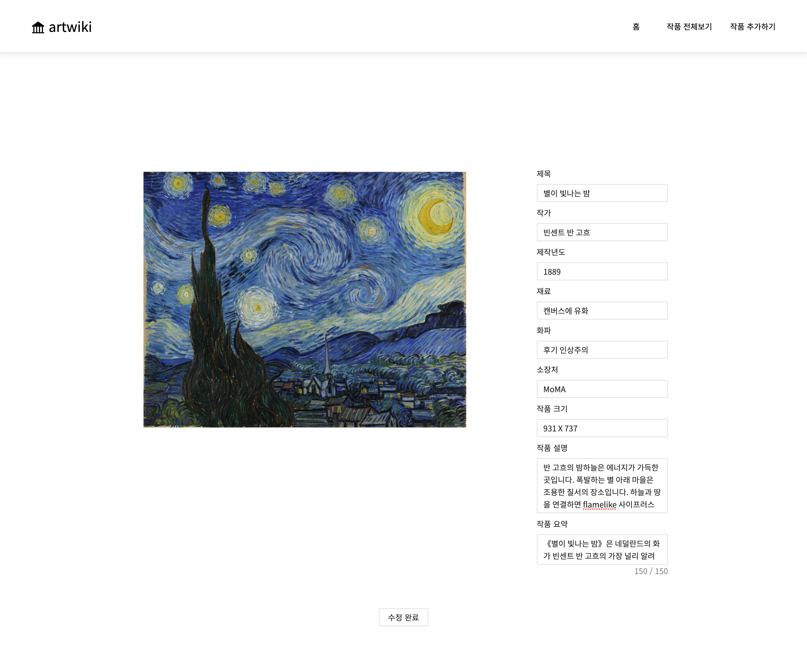
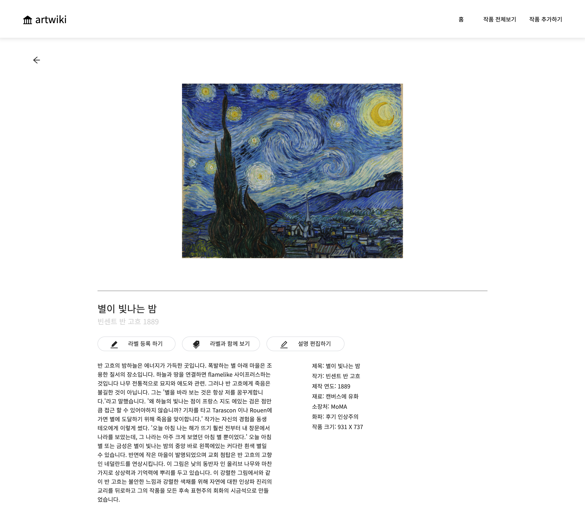

<!-- @format -->

# 2020-2 HCI Lab artwiki project

### 시각장애인의 예술 감상을 위한 크라우드 소싱 기반 온라인 아트 갤러리 연구

Crowdsourcing Based Online Art Gallery for Visual Impairment People, Artwiki project

### 프로젝트에서 맡은 역할

- Web front-end 개발 (react.js, next.js 사용)
- "[시각장애인의 예술 감상을 위한 크라우드 소싱 기반 온라인 아트 갤러리 연구](./docs)" 논문 1저자
- [2021 HCI Korea 학회](./docs) 발표자

### 연구 요약문

시각장애인들은 또래 정안인만큼 예술 작품 감상에 관심이 많다. 하지만 현존하는 시각 장애인 예술 감상 매개체는 단순한 작품 정보 전달에 그치거나 특정한 장소, 소수의 그림에만 적용되는 등 극도로 한정적인 범위에서만 이용할 수 있다.
본 연구에서 이러한 한계를 해결하기 위해 시각장애인들이 시간과 장소에 대한 제약 없이 작품 내 내부 요소에 대한 음성 설명을 들으며 감상을 들을 수 있는 크라우드 소싱 기반 온라인 아트 갤러리 웹을 제안한다. 시각 장애인들이 터치스크린 기반 개인용 기기를 통해 더 많은 작품을 쉽게 접하고, 작품 내부 요소를 직접 터치하며 전체적인 구도와 각각의 특징을 파악할 수 있게 함으로써 한정적인 정보 수용에 그치던 시각장애인의 예술 감상 영역을 주체적인 예술 경험 단계로 확장할 수 있을 것으로 기대한다.

### UI 소개

#### Home 화면

* 메인 페이지는 프로젝트 설명, 테마별 작품보기, 전체 작품보기로 이루어져 있다.
* 프로젝트 설명 페이지를 통해 이용자들에게 위 웹사이트의 목적을 알린다. 테마별 작품보기에서는 여러 작품을 한 테마로 분류하여 묶어 놓아 테마별로 작품들을 감상할 수 있도록 했다. 또한 시각장애인들을 위한 아트 갤러리인 만큼 깔끔하고 복잡하지 않도록 구성하였다.

#### Edit Image annotation 화면

* 불특정 다수인 크라우드 워커 (crowd worker)가 미술작품 내부 요소에 대한 정보를 제공할 수 있는 라벨링 화면은 리액트의 라이브러리인 ‘React Image Annotation’ 을 사용하여 구현하였다.
* 라벨링은 사각형 형태이며 크라우드 워커가 예술 작품의 원하는 부분에 드래그하여 라벨링하고자 하는 영역을 정하고, 드래그를 멈춰 마우스 클릭이 떼어짐과 동시에 내용을 입력할 수 있는 라벨이 나타난다. 내용을 입력하고 저장을 누르면 라벨링된 그림 오른쪽에 Annotation List에 작성한 라벨이 저장되어 표시된다.
* 라벨 오른쪽 부분의 delete버튼을 누르면 라벨이 삭제된다. 편집 저장 버튼을 누르면 리스트에 있는 생성한 라벨들이 저장되고 편집 취소를 누르면 저장되지 않는다.

#### Edit Image Description 화면

* 불특정 다수인 크라우드 워커 (crowd worker)가 그림에 대한 설명을 직접 입력할 수 있도록 그림마다 그림 설명을 편집할 수 있는 화면을 구현하였다.
* 크라우드 워커는 각 작품의 설명 부분을 자유롭게 수정할 수 있으며, 새로운 그림을 추가할 수도 있다.

#### Image Detail 화면

* 지금까지 예술 작품에 대한 전체적인 설명은 존재했지만 작품의 요소를 하나하나 설명해주는 가이드는 거의 존재하지 않았다.
* 라벨링 방식을 사용하면 작품의 요소마다 설명이 라벨되어 있으므로 시각장애인이 작품의 여러 곳을 직접 클릭을 해보면서 작품을 파악할 수 있다.
